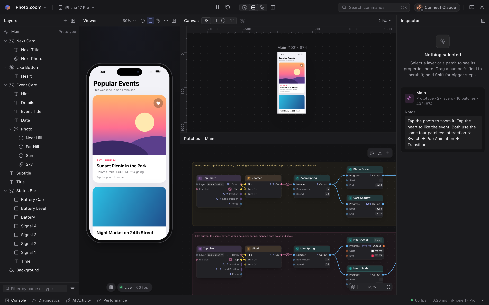
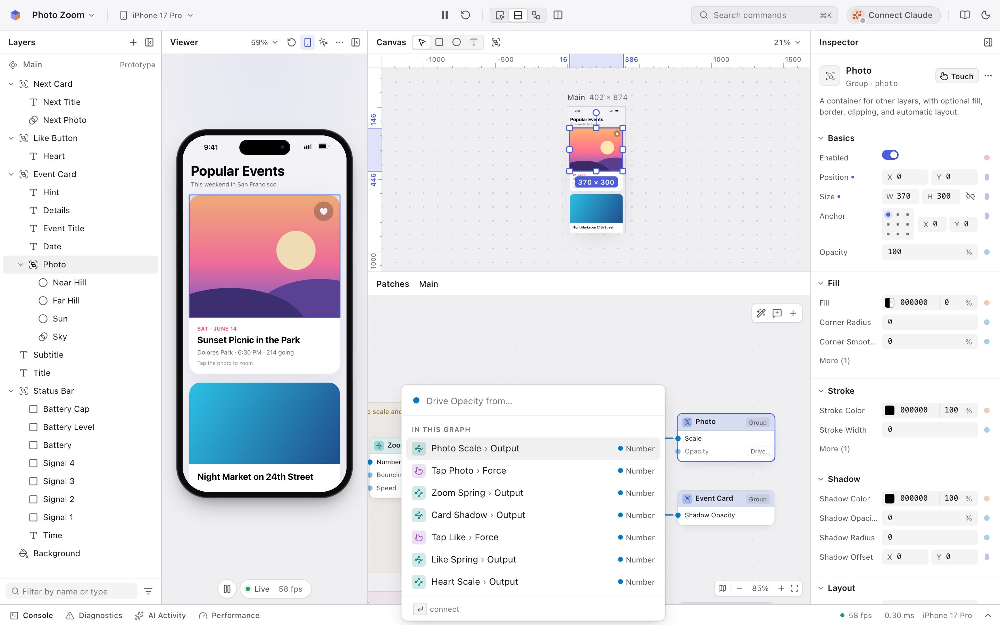
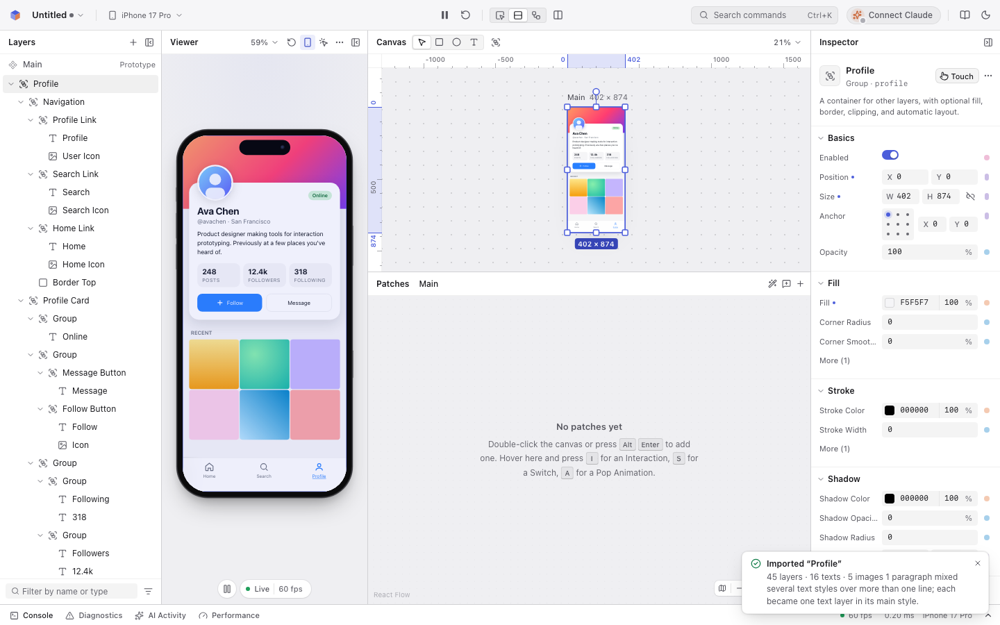
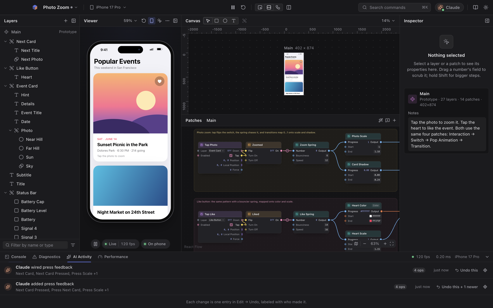
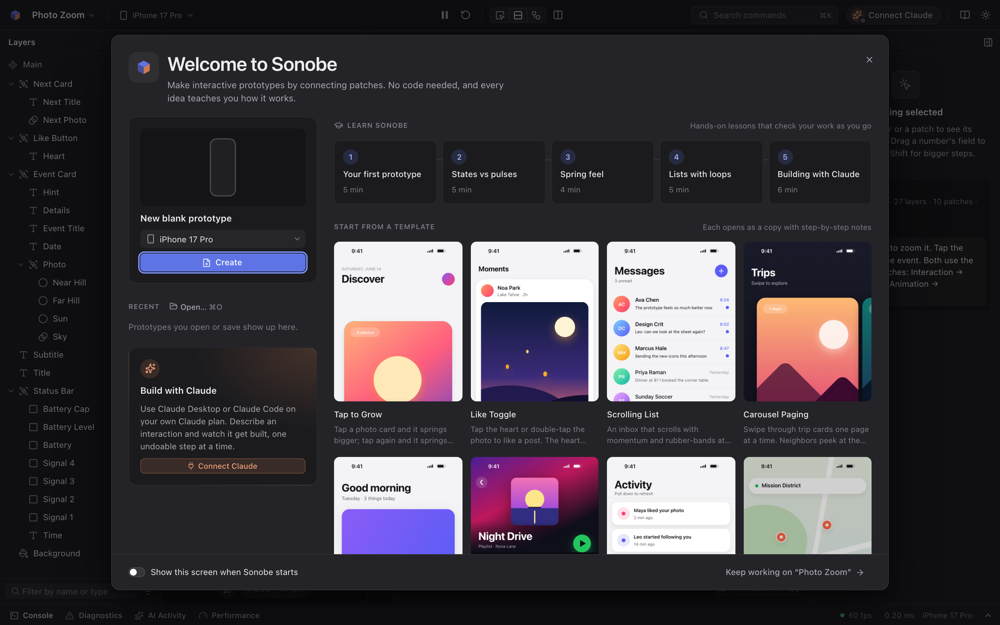
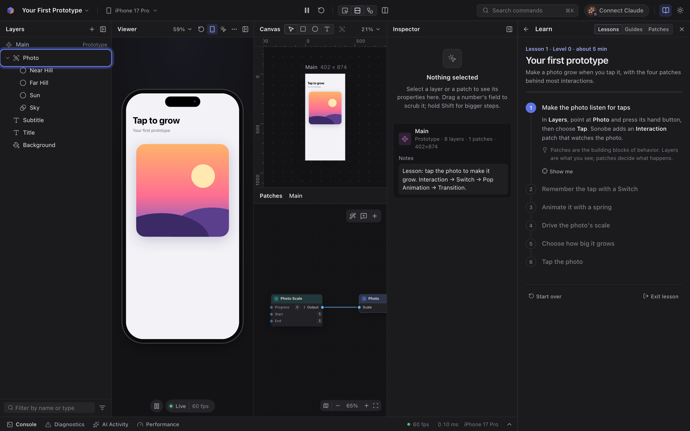

# Sonobe

**Interaction prototyping for everyone. Layers, patches, a live viewer, and Claude as your co-builder.**

<picture>
  <source media="(prefers-color-scheme: light)" srcset="docs/assets/editor-light.png">
  
</picture>

Sonobe is an open-source desktop app for building high-fidelity interactive prototypes. You design with layers, then bring them to life with *patches*: small building blocks that you wire together. Taps, springs, scrolling, state, loops, data, and sensors are all available, and the viewer keeps running while you edit.

If you've used Meta's Origami Studio, it will feel familiar. Sonobe is built so you never need a Facebook group to learn it:

- **AI-native.** Sonobe runs a local [MCP](https://modelcontextprotocol.io) server, so Claude Code or Claude Desktop can build, simulate, explain, and debug prototypes with you. Use your own Claude plan; you don't need an API key.
- **Learnable.** Pulses light up as they travel. Every patch has plain-language docs. Errors tell you how to fix them. Lessons and guides go from "never prototyped" to expert.
- **Open.** MIT licensed. Documents are readable JSON folders that work with git. Preview on your phone in a browser. It's an Electron app for macOS, Windows, and Linux, though so far only the macOS build is packaged and verified.

> **Status: pre-1.0.** Stages 1–3 (foundations, the engine, the MCP server and CLI, editor parity and polish) are done, and distribution is in progress: the macOS app builds and runs locally, while signed downloads and verified Windows and Linux builds are still ahead. Expect rough edges and breaking changes until 1.0. See [ROADMAP.md](ROADMAP.md).

---

## How it works

```
Layers                    Patches (the logic)                         Viewer
┌───────────┐   tap ┌─────────────┐ flip ┌────────┐  on  ┌───────────────┐ progress ┌────────────┐
│ ▢ Card    │──────▶│ Interaction │─────▶│ Switch │─────▶│ Pop Animation │─────────▶│ Transition │──▶ Card.scale
│   T Title │       └─────────────┘      └────────┘      └───────────────┘          └────────────┘
└───────────┘
```

The core pattern is **Interaction → Switch → Animation → Transition**. Tap something, remember the state, animate with a spring, and map the animation onto a property. Start there and add the rest when you need it: loops, components, data, and gestures.

Layers and patches connect in both directions. Press a layer's Touch button to add an Interaction patch, drag a cable onto a layer property, or pick what drives a property from a list of everything in the graph.



## Import your designs

Prototype with the real thing instead of redrawing it. **File → Import Design…** opens a screen from your running app (`http://localhost:3000/settings`, a Storybook story, any page) in a hidden browser window, reads the finished layout, and adds it to your prototype as ordinary layers: groups with fills, borders, radii and shadows, text in the page's own web fonts, images and SVG icons saved as assets, and text fields you can type into. Fixed bars stay put, long pages and scroll areas come with Scroll patches, and layers take their names from `data-name`, React and Vue component names, labels and roles. One undo removes it.



In Chrome, the [Sonobe Capture extension](integrations/chrome-extension/README.md) copies any page or a single element you pick, even on signed-in pages, and ⌘V pastes it into Sonobe the same way. A [Figma plugin](integrations/figma-plugin/README.md) does the same for frames (not yet verified inside Figma).

Your design doesn't have to be a web app. Paste HTML, or ask Claude from your app's folder: *"Rebuild ProfileView from my SwiftUI code as HTML, import it into Sonobe, then make the Follow button bounce when I tap it."* Claude reproduces the screen, imports it with the `import_design` tool, compares a screenshot with the source, and wires the interaction onto the imported layers. It can also design new screens this way. [Guide 12](docs/guides/12-importing-designs.md) has the details.

## Install

Sonobe needs Node 22.18 or later. There are no prebuilt downloads yet, so you build the app from a checkout.

### The desktop app (macOS)

```bash
npm install
npm run package -w @sonobe/desktop
```

On an Apple silicon Mac, this builds the editor, the app, and the `sonobe` CLI, then writes `apps/desktop/release/Sonobe-0.1.0-mac-arm64.dmg`. Open the DMG and drag Sonobe into Applications. For an Intel Mac, add `-- --arch x64`.

Local builds are ad-hoc signed and not notarized. That's enough to run the app on the Mac that built it, but not to give it to other people. To check a build, run `npm run package:verify -w @sonobe/desktop -- --dmg`. It launches the app from inside the DMG with audio muted, then checks the editor, the MCP endpoint, and the bundled CLI.

Windows (NSIS) and Linux (AppImage, deb) targets are configured in `apps/desktop/electron-builder.yml`, but those builds haven't been verified yet.

### From source, for development

```bash
npm install
npm run dev                       # the editor in a browser at http://localhost:5199
npm run build -w @sonobe/editor   # build the editor once, then:
npm run desktop                   # launch the Electron app
```

To run the desktop app against the dev server instead of the built editor, start `npm run dev` and then run `SONOBE_DEV_URL=http://localhost:5199 npm run desktop`.

```bash
npm test                          # unit tests (Vitest)
npm run typecheck
npm run e2e                       # Playwright end-to-end tests
npm run smoke -w @sonobe/desktop  # muted Electron smoke test: host API, MCP, phone preview
npm run test:ios                  # Sonobe Viewer on an iOS Simulator (macOS with Xcode)
```

### The `sonobe` CLI

The CLI creates, checks, and simulates prototypes, and it's the bridge Claude uses to reach Sonobe. Build it into one self-contained file that runs on Node 22 or later:

```bash
npm run build -w @sonobe/cli
node packages/cli/dist/sonobe.mjs --help
node packages/cli/dist/sonobe.mjs new "Photo Zoom.sonobe" --template photo-zoom
node packages/cli/dist/sonobe.mjs validate examples/08-bottom-sheet
node packages/cli/dist/sonobe.mjs outline examples/08-bottom-sheet
node packages/cli/dist/sonobe.mjs describe popAnimation
```

After a build, `npm link -w @sonobe/cli` puts `sonobe` on your PATH. Inside the repo you can skip the build with `npm run sonobe -- <command>`. The packaged app ships the same CLI at `Sonobe.app/Contents/Resources/cli/sonobe`, running on the app's own runtime, so it doesn't need a separate Node install. The [CLI README](packages/cli/README.md) documents every command.

## Build with Claude



Sonobe runs an MCP server on `127.0.0.1` that only accepts requests carrying the token the app writes to `~/.sonobe/mcp.json`. Claude connects through `sonobe mcp`, a small relay that reads the token for you, so there's nothing to paste. The easiest way to set it up is in the app: click **Connect Claude** in the toolbar (or choose Help → Connect Claude…) and copy the command it fills in for your machine.

### Claude Code

With the packaged app in your Applications folder, run this once, from any folder:

```bash
claude mcp add --scope user sonobe -- /Applications/Sonobe.app/Contents/Resources/cli/sonobe mcp
```

From a checkout, build the CLI bundle once, then use its absolute path:

```bash
npm run build -w @sonobe/cli
claude mcp add --scope user sonobe -- node "/absolute/path/to/sonobe/packages/cli/dist/sonobe.mjs" mcp
```

`--scope user` gives every Claude Code session Sonobe's tools, whatever folder it starts in. If you set Sonobe up before, an older entry may be tied to one folder, and it wins there: run `claude mcp remove --scope local sonobe` in that folder. Check the setup with `claude mcp list`, keep Sonobe open, and ask Claude, "List the documents open in Sonobe." The Connect Claude screen lists each session once it connects, with its folder and last activity, and the toolbar's Claude button turns green only while a session is connected.

The Claude Code plugin adds the same server plus a skill that teaches Claude Sonobe's workflow. From a checkout:

```bash
node integrations/claude-code/build.ts
claude --plugin-dir ./integrations/claude-code
```

To let Claude work on a project folder without the app running, use headless mode. It supports editing, simulation, saving, and approximate screenshots. It works on one prototype, so add it in the folder where you start Claude:

```bash
claude mcp add --scope local sonobe-headless -- node "/absolute/path/to/sonobe/packages/cli/dist/sonobe.mjs" mcp --headless "/absolute/path/to/Prototype.sonobe"
```

### Claude Desktop

Build and pack the Desktop Extension from a checkout:

```bash
node integrations/claude-desktop/build.ts
npx @anthropic-ai/mcpb pack integrations/claude-desktop/dist sonobe.mcpb
```

This writes `sonobe.mcpb` at the root of your checkout. Open it with Claude Desktop, or choose Settings → Extensions → Advanced settings → Install Extension… and pick the file. Claude Desktop shows what the extension runs; confirm, and Sonobe's tools appear under Connectors. If you'd rather edit `claude_desktop_config.json` by hand, open Connect Claude… → Claude Desktop in Sonobe, which shows an entry with full paths for your machine.

[integrations/claude-code](integrations/claude-code/README.md), [integrations/claude-desktop](integrations/claude-desktop/README.md), and [guide 11](docs/guides/11-working-with-claude.md) cover the details and troubleshooting.

### What to ask

- *"Make the card expand into a detail view with a bouncy spring when I tap it."*
- *"Why doesn't my bottom sheet close when I drag down fast?"*
- *"Explain this patch graph like I'm new to prototyping."*

Claude reads the document structure, looks up real patch ports, and applies typed operations in batches that are all or nothing. It simulates taps and drags, traces values frame by frame to prove the result, and takes screenshots. While it works, the AI Activity panel shows what it's changing. Each batch lands in the same undo history as your own edits, labeled with who made it, and one undo removes it.

### Tested with Claude

During Stage 3 we gave a real Claude Code session (version 2.1.273) four tasks, phrased the way people actually ask. Claude could use only Sonobe's MCP tools, with no shell and no file reading or editing, and each run started from a fresh project served in headless mode. It completed all four:

| Task | Starting point | What Claude did | Run |
|---|---|---|---|
| A beginner's heart like button that pops, turns red, and un-likes | Blank project | Built it, simulated taps, traced the spring, tidied the graph, and explained it for a beginner before saying it was done | 88 s, 18 turns, no errors |
| A designer's iOS-style bottom sheet that drags open and flicks closed | Blank project | Built it and verified it with simulated drags. It recovered from one tool error by following the error's hint | 210 s, 27 turns, 1 error |
| "My bottom sheet doesn't close when I flick it down fast" | Example 08 with a cable removed | Traced the release frames, found the missing gesture velocity link, fixed it with one `connect`, and showed before-and-after frames plus two regression checks | 94 s, 19 turns, no errors |
| "Explain how this works, then make the cards snap with a bouncier feel" | Example 04 | Explained layers, patches, and the common chain in plain words, retuned the spring, and traced it to confirm it still settles | 149 s, 30 turns, no errors |

The runs also showed where Claude struggled, and those problems are fixed. Tool results now carry their full text for clients that read only structured content. A batch can use a `$ref` before the op that creates it. `get_guide` takes several topics at once. Headless servers take screenshots. And the feedback-loop diagnostic says when a loop is intentional.

## What's in the box

<p>
  
  
</p>

- **199 patches** in 16 categories, from Interaction and Pop Animation to Loop Builder, Network Request, and JavaScript. Each one has hover docs in the editor and a reference page in [docs/patches](docs/patches/README.md).
- **15 layer types**, including text fields, Lottie, shaders, clones, and component instances, with row, column, and grid layout.
- **16 examples** in [examples/](examples/README.md), from Tap to Grow to the Placemark Deck. Each is a project folder with a step-by-step README and scripted tests that simulate the interaction. Open them from the welcome screen or the Learn drawer.
- **5 interactive lessons** that check your work as you go: Your first prototype, States vs pulses, Spring feel, Lists with loops, and Building with Claude.
- **Design import** from a running app, HTML, or Claude, into real layers ([guide 12](docs/guides/12-importing-designs.md)).
- **Knobs and presets.** Turn any number, color or switch into a knob with a slider, tune it while the prototype runs, and flip between presets like "Shipped app" and "Proposal" with ⌘' ([guide 13](docs/guides/13-knobs-and-presets.md)).
- **13 guides** in [docs/guides](docs/guides/README.md), from your first prototype through debugging, coming from Origami, working with Claude, importing designs, and knobs and presets.
- **An MCP server with 47 tools** in seven groups: discovery (patch and layer docs, workflow guides, the verified examples as patterns to follow), documents, reading (outline, search, diagnostics, plain-language explanations), writing (atomic batches of typed ops, and importing designs), knobs (named values to tune, and presets like "Shipped app" to compare), simulation (taps, drags, traces, simulation-only overrides and presets, screenshots), and presence and history (show what Claude is doing, restart the live viewer, undo). It also offers four prompts: `import_screen`, `prototype_interaction`, `debug_interaction`, and `explain_prototype`. The [MCP README](packages/mcp/README.md) lists every tool.
- **The `sonobe` CLI** with `new`, `validate`, `fmt`, `outline`, `describe`, `sim`, and `mcp`.
- **A Claude Code plugin, a Claude Desktop extension, and a Chrome extension** in [integrations/](integrations/).
- **Phone preview and a pop-out viewer.** Scan a QR code to run the live prototype in your phone's browser on the same network, with sound, network requests and the camera like the viewer. Restarting in Sonobe restarts it on the phone, and a three-finger tap opens a menu there. On an iPhone, the Sonobe Viewer app plays it with real haptics ([apps/ios](apps/ios/README.md); build it with Xcode).
- **An optional in-app Assistant** in the desktop app, for people who'd rather use their own Anthropic API key than Claude Code or Claude Desktop. The key is kept in your operating system's keychain.

## Repository layout

| Path | What's inside |
|---|---|
| `packages/core` | Document model, operations, history, diagnostics, file format |
| `packages/engine` | Runtime: patch evaluation, springs, layout, hit testing, gestures |
| `packages/patches` | The built-in patch library, with specs, behavior, and docs |
| `packages/renderer` | DOM renderer and input capture for the viewer |
| `packages/import` | Design import: the capture format, the DOM walker that reads a rendered page, and the converter into layers |
| `packages/mcp` | MCP server: the tools Claude uses, and the headless host |
| `packages/cli` | `sonobe` CLI: new, validate, format, outline, describe, simulate, MCP relay |
| `apps/editor` | The editor UI (React) |
| `apps/desktop` | The Electron shell, MCP endpoint, phone preview, and packaging |
| `apps/ios` | Sonobe Viewer, an iPhone app that plays phone previews with real haptics (Swift, Xcode) |
| `integrations` | The Claude Code plugin, the Claude Desktop extension, and the Sonobe Capture extension for Chrome and plugin for Figma |
| `examples` | 16 runnable example projects with scripted tests |
| `docs/guides` | Concept guides and recipes |
| `docs/patches` | The generated patch reference |
| `docs/research` | Research notes behind the design |

Read [ARCHITECTURE.md](ARCHITECTURE.md) before contributing code.

## Learn

Start with [docs/guides](docs/guides/README.md): your first prototype, states vs pulses, springs and feel, gestures, loops, components, debugging, working with Claude, importing designs, and knobs and presets. The same guides, the lessons, and the patch reference are in the app under Help → Learn Sonobe.

## Contributing

Issues and pull requests are welcome. Good first contributions are patch implementations, recipes, and guide improvements. [CONTRIBUTING.md](CONTRIBUTING.md) covers setup and the rules the code follows.

## License

[MIT](LICENSE)

*Sonobe is an independent open-source project. It is not affiliated with or endorsed by Meta. "Origami Studio" is a trademark of its respective owner and is mentioned only to describe compatibility and familiarity.*
